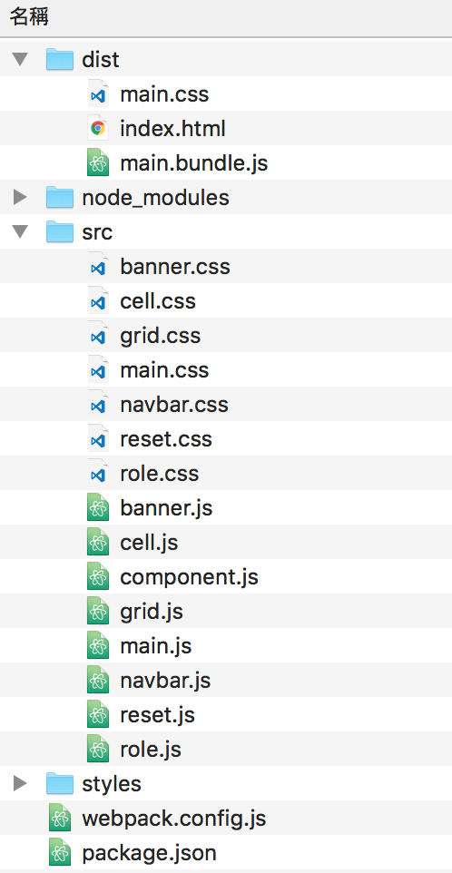

# Lab5 quiz - Tic-Tac-Toe

## 離開前請簽名！！！！

## Grading
### `0. You need to build the game using components.`
If you don't use components, you will get 0 points.  
And you must use webpack to compile your js and css code into one js file(main.bundle.js). In your html, you should import main.bundle.js ONLY (and vendor.bundle.js if needed).  
<b>Don't import your component.js and component.css.</b>

### 1. Can present 'O' / 'X' when the cell is clicked. (10%)

### 2. Can alternate between turns (O->X->O->X) (15%)

### 3. Turn component can present which turn ('O' / 'X') it is now. (15%)

### 4. Can judge the outcome (check if someone wins) and present score of two side on Role component. (win (+1) / draw (+0)) (35%)
And you need to reset all cell when the game comes to a close.

### 5. Reset all cells and role points when reset button is clicked. (15%)

### 6. Whole game works well. (10%)

### Bonus (15%)
#### Bonus will get 100% points for all submission before 23:59.
1. Decorate the game by using some css. (10%)  
`The grading of css is VERY subjective.`  
But if you can layout your components as the image above, you will get at least 8 points.
2. Notify user who wins the game when the game comes to a close. (Can't use alert / console.log) (5%)

## Example
https://www.google.com.tw/search?q=tic+tac+toe

## Sample structure

## Submission
Open a new merge request when you finished your quiz.  
We'll accept all merge requests so that you can open new request after the lab (after 18:00). 

## `IMPORTANT` 
From now on, we will not help you to deal with any git problems during the quiz. 
If there's nothing in your branch, you will get 0 points.
